# Animation Guide
Written on versions:
- Blender: `4.5.2`
- Godot: `4.7.1`

Quick Access:
- [Blender Specific](#everything-blender)
- [Godot Specific](#everything-godot)

## Introduction
This guide aims to inform and help solve issues when importing **Blender** animations to **Godot**. After a lot of trial and error, the following guide is what has worked best and successfully from experience.

## Everything Blender

> ### Root Bones
The first thing to mention is that your Blender armature **needs** to have a `ROOT` bone in order for the armature to work well with Godot's Inverse Kinematic systems.

If your model has no `ROOT` bone:
- Enter edit mode on your armature
- Find the bone which all other bones are parented to (this can be done by entering pose mode and moving bones around to see which one controls the rest)
- (Back in edit mode) From the head or tail (depending on how the bone is orientated), use the `Extrude` function to extrude a new bone
- Rename the new bone to `ROOT` or `_ROOT` depending on preference. This name makes it absolutely clear to both you and Godot what it's function is. It will also allow Godot to automatically recognise it as the root bone for the armature
- While still in edit mode, select the previous bone you extruded from, then `CTRL + LMB` the new root bone
- Press `ALT + P` (parent functions) and select `> Keep offset`. This will parent the armature to the new root bone

If you now enter pose mode and move the new root bone, you will see all other bones are now parented to it. Success.

---

> ### Deformation Bone Definitions

> **This step is most important when exporting to gLTF 2.0**. When this was written, the animation was already baked (next section in this document) but the deform was set to true in baking. In Godot this animation works perfectly. So this section might get removed as it might not be a necessary step. However, better to have it and not need it than not have it and it's the step that breaks everything.

We need to tell Godot which bones are deformation bones are which are not. To do this:
- Enter pose mode
- Select each bone that is not classed as a deformation bone in your armature. This might include:
    - IK Targets
    - IK Poles
    - Rotational Targets
    - Etc
- With the bone selected, go to `Bone Properties` and uncheck the `Deform` value

Here is an example. The left hand IK target, which should not be a deform bone, is selected and in the Bone Properties the `Deform` value will be unchecked:

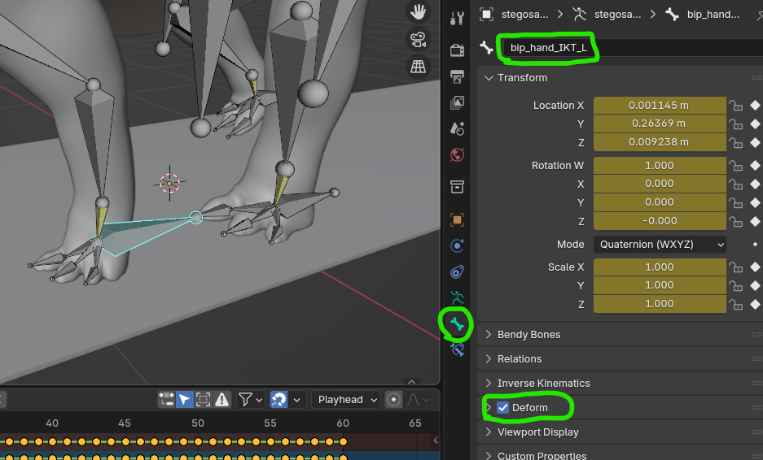

Do this for all bones you deem as non-deformation bones. This is specific to your model, armature and the needs of both.

---

> ### Blender IK / Action Baking

> #### **This step is very important if you use Blender's Inverse Kinematic components. This step excludes the import settings for Godot which are below in this document. Examples are reference only, rectify method is valid and should be taken before importing to Godot.**

Godot **completely ignores Blender's Inverse Kinematic data**. As such, if you use Blender's IK components you need to **bake** the IK data into the animation actions.

Below is an example of the issue:

In this example, all legs and arms use Blender's IK components. You can see that in Godot, using the `AnimationPlayer`, the two front hands are "locked". They are essentially locked into their Blender IK target positions.

To rectify this issue, this method has worked from experience:
- Select the animation action from the `Action Editor` you wish to bake:
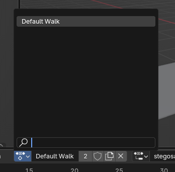
- Enter pose mode on your armature and use `A` to select all bones
- In the top toolbar, head to `Pose > Animation >` and select `Bake Animation`
- Your screen should look similar to this:
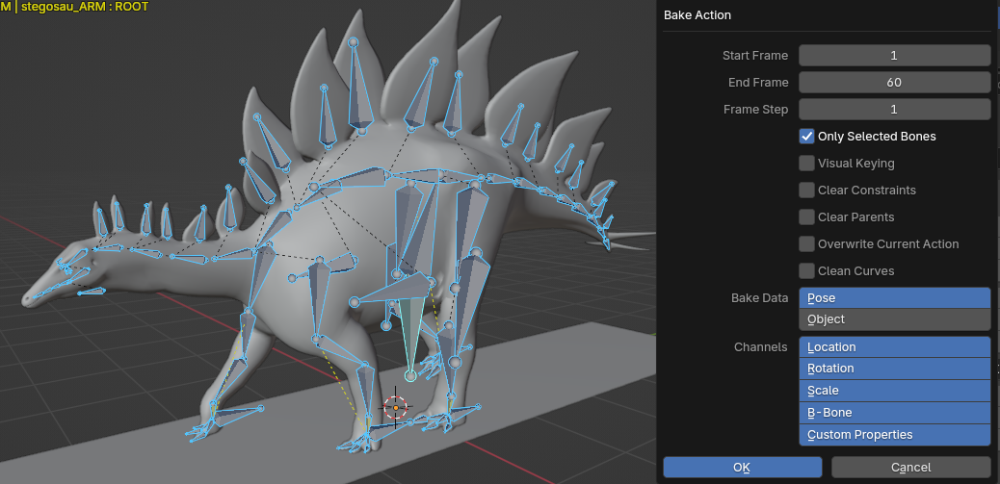
- Within the Bake Action window make sure:
    - Only Selected Bones = `TRUE`
    - Visual Keying = `TRUE`
    - Overwrite Current Action* = `TRUE`
    - Channels should equal your needs, common cases would include Bone, Position, Rotation and Scale
- Click `OK` to bake the animation action

\*Only do this if you **do not** want the bake operation to place the result on a new animation strip.

Your Action Editor should now look similar to this:

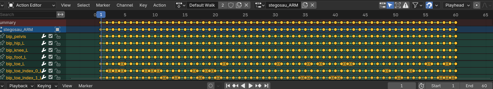

Make sure you either save or save as. Personally it's best to save as, since keeping baked animations seperate is a preference. However you could achieve this by not checking `Overwrite Current Action` in the bake window. Then in Godot you would have a baked and a non-baked animation.

For reference, after doing the baking operation, back in Godot when selecting the animation within the `AnimationPlayer`, it can be seen that it works as expected:

---

> ### Exporting to gLTF 2.0
When exporting to gLTF 2.0 there are some common settings to apply:
> GREEN dashes are necessary 
> ORANGE dashes are optional 
> NO dashes is default values

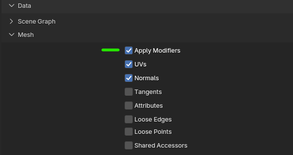

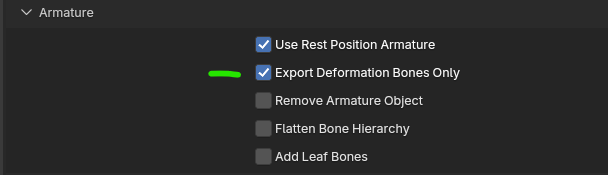

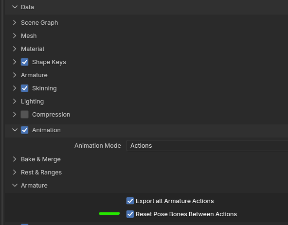

Materials are optional depending on needs. Personally this is set to `No Export` as manual implementations are preferred. If you use a singular animation workflow where each animation manages it's own files, exporting materials can clog up folder structure fast since it will export each texture for each model.

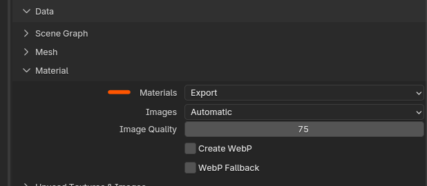

---

## Everything Godot

> ### Animation Folder Structure
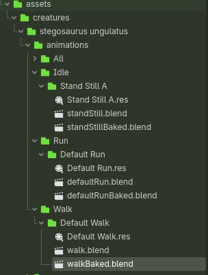

> This only applies to a singular animation workflow where each animation is segregated from the rest. Personally this is a better choice since it allows for easy animation changes without fear of breaking others and good folder/file organisation.

While it is completely up to you, above is a recommended folder structure for a couple reasons:
1. When extracting animation clips, Godot will place them in each individual folder allowing for easy organisation
2. Each animation, any baked variations, alteration or improvement variations can all be organised into one folder specific to them
3. Having multiple Walk animations, for example, allow for a parent "Walk" folder and then any variated walk animations can be organised into the parent folder
4. You can split each animation type (walk, run, whatever) into it's own Animation Library. If you are using human armature this would allow you to use the same libraries across different models given they have the same armature setup

---

> ### Importing
To import new animations, either save them to a folder within the Godot project from Blender or simply drag and drop them into a folder from your file explorer.

In Godot, you can double click an imported file/resource to open the advanced import settings. Select an imported animation (.blend or gLTF 2.0) and double click it:

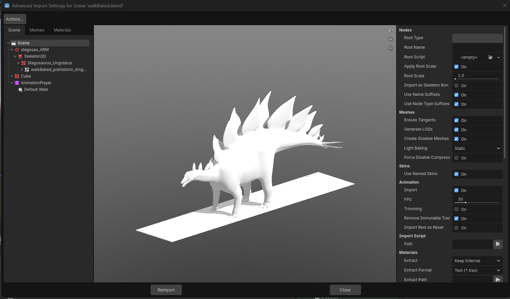

With the animation file's advanced import settings open, there are some considerations to make within the left-most hierarchy:

> ### > Scene
Options with an orange dot have been modified to fit the same Blener configuration or remove Blender objects.

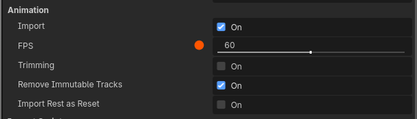

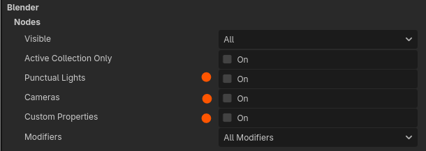

> ### > Scene > [Armature Name] > Skeleton3D
The first thing to do is define a new `BoneMap` with a Skeleton Profile that suits your needs. For humanoid or animal based characters the `SkeletonProfileHumanoid` works well. You might need to retarget some bone definitions such as the hips or arms, which you can do by selecting a green or red dot on the human figure.

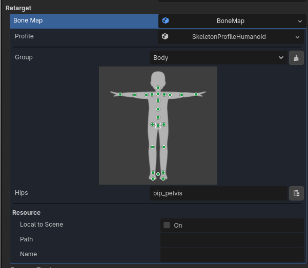

The `Rename Bones` option is important. If you select this, you must select it on all of your animations and the final model armature you will use to play animations on. If you don't, Godot will rename the bones and it will break their attachment to their relative positions within animation clips.

The same applies to `SkeletonName` option. Godot will rename it to whatever is in the textbox, and if it does not match the armature name within animation clips, the animations will break completely.

> **It is important to set these correctly before extracting animation clips.**

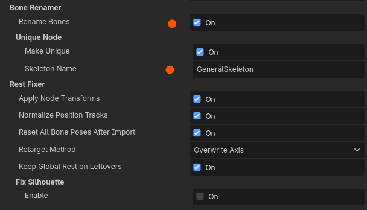

It's at this point you can view your animation by selecting it under the `AnimationPlayer` node and previewing it. If it does work correctly or there are issues, this is the time where you can decide next steps. Such as [baking animation](#blender-ik--action-baking) or making adjustments.

Once everything is setup, you can click "Re-import" to apply the changes and you are ready to move onto the next section.

---

> ### Extracting Animation Clips
This method applies to any animation, any format, regardless of baking or otherwise:
- In the top left corner of the advanced import window you should see "Actions":
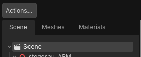
- Click `Actions > Set Animation Save Paths`
- In the new window specify the folder where the extracted animation will be stored, this is usually within the folder containing the animation files (.blend / gLTF 2.0)
- Click the "Select Current Folder" button and then "Set Paths" to confirm

When you are done, click "Re-import" and you should now see the extracted animation in the specified save folder.

---

> ### Setting Up Animations
To setup animations you need a an armature model. Personally this is a file containing the mesh, armature and **no animations**. The bone structure needs to obviously match the same armature your animations use.

Using a base template for all animations is a good idea. You create a version of the file with any IK setup you might use, no animations and just the mesh. You then essentially clone this file, create an animation and save it as a new file following the above import process. If you need to make changes to an animation it's all contained within one file without a worry of breaking other animations so long as the only thing you do change is the animation action and not any bone names etc.

To setup animation:
- Drag a model as described above into a new scene
- Right click the model base and select `Editable Children`. This will allow you to see the skeleton and anything else within the models scene
- Under the model base, add a `AnimationPlayer` node
- Within the Animation Player properties, choose the root node of the model:
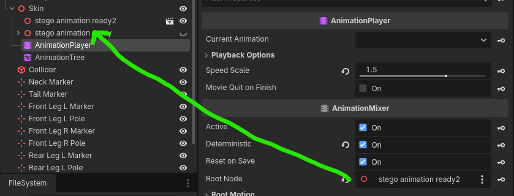
- In the bottom tabs, select "Animation", then select the upper "Animation" button and select "Manage Animation":
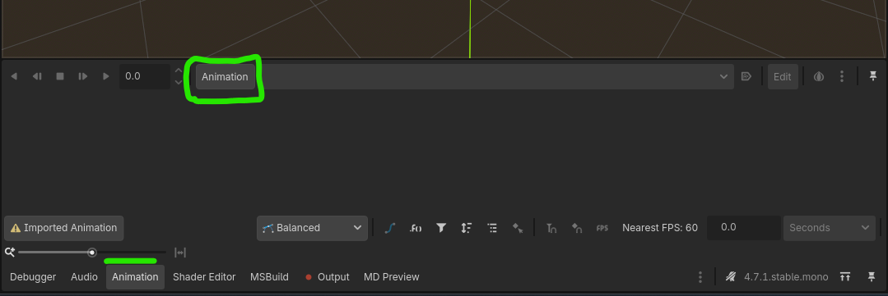
- Select "New Library" and give it a name ("Library" in this case), then use the load button to select all animations you have extracted or want to use:
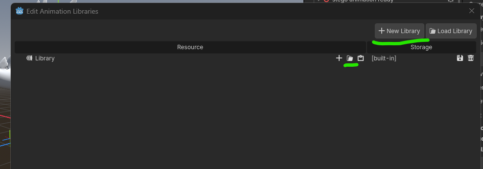

Once done, click "OK" and you should now have animation setup on the armature.

To make animations loop, you can either select the animation within the advanced import window and choose a loop mode, or you can use the little button in the Animation panel to change the state of looping:

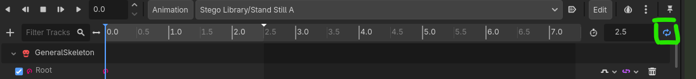

---

> ### Setting Up Dynamic Legs & Arms (TwoBoneIK3D)

> ### Setting Up Dynamic Necks & Tails (IterateIK3D)
